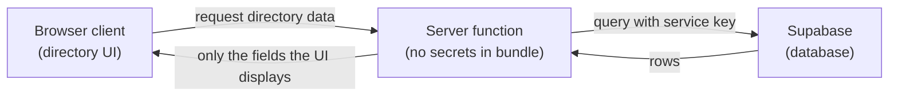

# Client vs Server Inventory — Hockey Operations Directory

**Related:** `docs/boundary-risk-notes.md` (Step 1 risks this inventory operationalizes)

## Plain-language model

Think of a restaurant: the dining room is the browser client — anything a
customer can see, hear, or photograph there is effectively public, even if
they weren't "supposed" to notice it. The kitchen is the server — customers
never go back there, so the recipe and the safe combination stay invisible
no matter how closely they watch the dining room. A waiter carrying out a
finished plate is the server function: the customer gets the result, never
the process or ingredients behind it.

| Side | Who runs the code? | Who can see it? | Can it hold secrets? |
|------|--------------------|-----------------|----------------------|
| Browser client | The user's device (the directory pages) | Anyone using DevTools / view-source | **No** — treat everything here as public |
| Server | Machines your team controls | Only your backend and trusted services | **Yes** — service keys and privileged queries live here |

## 1. Safe on the browser client

- **Players/staff table and filter UI** (`app/routes/players/index.tsx`,
  the Sprint 1 filter controls). *Why:* this is exactly the layout and
  interaction Sprint 1 already proved works, and it's meant to be seen.
- **Calling the server function and rendering whatever plain rows it
  returns.** *Why:* the component only ever holds already-fetched data,
  never a credential.
- **Type shapes like `PlayerPosition` / `PlayerRosterStatus`**
  (`app/data/hockeySeed.ts`). *Why:* these are just labels ("F", "D", "G"),
  not secrets — knowing the shape of the data doesn't expose anything.

## 2. Must stay on the server

- **The Supabase service-role key itself.** *Why:* this is the actual
  "recipe" — full read/write access to the database.
- **The Supabase client construction** (future `app/lib/supabase.server.ts`).
  *Why:* it's the only thing that ever touches the key.
- **The actual database read/query logic** — what replaces `listPlayers()`
  / `getPlayerById()` in `app/server/directoryLoader.ts` once it queries
  Supabase instead of the seed array. *Why:* the query itself can reveal
  schema or filtering details a stranger shouldn't get for free.
- **Raw error messages from a failed Supabase call.** *Why:* a raw database
  exception can leak table names, column names, or connection details;
  staff should see a generic "couldn't load directory" message instead.

**Resolved boundary rule:** the server function returns *only* the exact
fields the UI displays — never extra fields "just in case." This closes the
one open question from the first draft of this inventory: an
over-returning server function isn't a leaked credential, but it's still an
over-sharing bug (an unpublished status, an internal note, anything not
meant for whoever's looking at the page). Every new field the server
function returns should map to a field the UI actually renders — if it
doesn't, cut it before it ships, not after.

## 3. Boundary questions still open

- Does this project need a Supabase anon/public key at all, given the
  client never talks to Supabase directly — or is "no client-side Supabase
  key whatsoever" the right answer?
- What should the server function return on a Supabase failure — an empty
  list, a typed error result, something else?
- Does filtering (position, active/inactive) happen in the Supabase query
  itself or in the pure mapper after the rows come back?

## Diagram (keep secrets on the right)

**Rule of thumb:** if leaking it would let a stranger read or change hockey
ops data, it belongs on the server side of this picture.

## How I will use this inventory later

- When an agent proposes code, check every new import and env read against
  sections 1 and 2.
- Reject any client-bundled file that imports server-only modules or secret
  env names.
- Check every field the server function returns against the "only what the
  UI displays" rule above.
- Revisit section 3 when writing the server-function contract and env
  separation steps.
